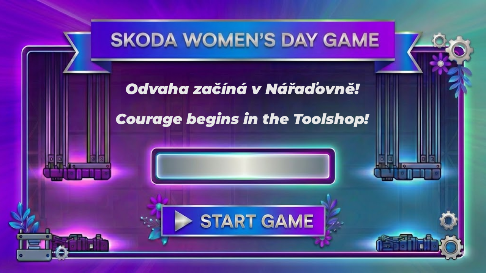

# 🎮 SKODA Woman's Day Game

> **Courage begins in the Toolshop!**  
> An arcade mini-game built with C++ & SDL2, playable natively on desktop or directly in the browser via WebAssembly.

---

## 📸 Screenshots

| Start Screen | Gameplay |
|:---:|:---:|
|  |  |

---

## 🕹️ How to Play

| Key | Action |
|-----|--------|
| `Space` | Launch the car upward |
| `Enter` | Stop the presses |

Enter your name on the start screen, hit **START GAME** and survive as long as you can!

---

## 🛠️ Tech Stack

| Layer | Technology |
|-------|-----------|
| Language | C++17 |
| Windowing & Rendering | SDL2 |
| Image Loading | SDL2_image |
| Text Rendering | SDL2_ttf |
| Web Build | Emscripten → WebAssembly |

---

## 🚀 Getting Started

### Prerequisites

**macOS**
```bash
brew install sdl2 sdl2_image sdl2_ttf
```

**Web build (additional)**
```bash
brew install emscripten
```

---

### ▶️ Desktop Build

```bash
# Build
make

# Run
./build/game
```

---

### 🌐 Web Build

```bash
# Build for browser
make web

# Build + start local server on :8080
make web-serve
```

Then open **http://localhost:8080/game.html** in your browser.

The web build outputs four files to `web_build/`:

| File | Description |
|------|-------------|
| `game.html` | Page with the embedded game |
| `game.js` | Emscripten JS runtime |
| `game.wasm` | Compiled game (WebAssembly) |
| `game.data` | Packed assets (textures, fonts) |

> [!NOTE]
> WebAssembly requires a proper HTTP server — opening `game.html` directly from the filesystem (`file://`) won't work due to browser security restrictions.

---

### 🧹 Clean

```bash
make clean        # remove desktop build artifacts
make web-clean    # remove web build artifacts
make re           # clean + rebuild desktop
```

---

## 📁 Project Structure

```
womans_day_game/
├── Assets/           # Game assets (PNG images, fonts, CSV)
├── DefaultAssets/    # Fallback assets (default image, font)
├── Components/       # Reusable game components
│   ├── image.h/cpp
│   ├── button.h/cpp
│   ├── Camera.h/cpp
│   └── ...
├── Core/             # Engine core
│   ├── engine.h/cpp        — SDL init, window, render loop
│   ├── SceneManager.h/cpp  — Scene base class & object management
│   ├── object.h/cpp        — GameObject with components
│   ├── sprite.h/cpp        — Sprite rendering
│   └── ArchiveUnpacker.h   — Asset loading from disk
├── Scenes/           # Game scenes
│   ├── main.cpp            — Entry point
│   ├── StartScene.h/cpp    — Name input & start button
│   ├── MainGameScene.h/cpp — Core gameplay
│   ├── WinScene.h/cpp      — Leaderboard
│   ├── Paddle.h/cpp        — Player car
│   ├── Press.h/cpp         — Moving press obstacles
│   └── ScoreBoard.h/cpp    — CSV leaderboard
├── web/
│   └── shell.html    # HTML shell template for web build
├── Makefile
└── README.md
```

---

## 🎯 Game Flow

```
StartScene  ──▶  MainGameScene  ──▶  WinScene
 (name input)      (gameplay)        (leaderboard)
```

---

## 📄 License

Internal project · SKODA Auto · 2025–2026
